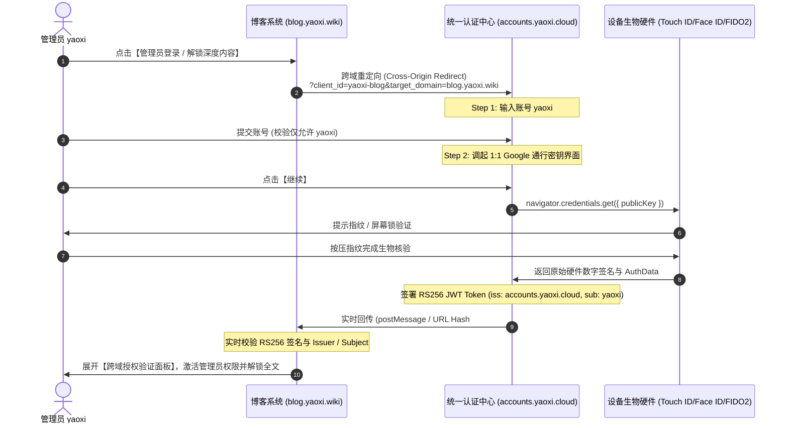

# accounts.yaoxi.cloud 统一身份认证中心

基于 **OAuth 2.0 / OIDC 协议** 与 **FIDO2 / WebAuthn 通行密钥 (Passkey)** 规范打造的生产级统一身份认证系统。1:1 像素级复刻 Google Identity v3 (Material 3) 登录交互与视觉体系。

---

## 🌟 核心特性与架构升级

- **泛域名全面支持**: 支持 `*.yaoxi.wiki` 与 `*.yaoxi.cloud` 全子域，任何携带合法防伪凭证的子域均可无缝拉起登录。
- **零前端调试干扰**: 移除开发期 JWT 数据流、Base64 串与倒计时；错误状态采用标准 Google 400 简洁提示，不暴露任何内部安全参数。
- **开箱即用 SDK (`sdk/yaoxi-auth.js`)**: 类似 Google 登录 SDK，支持 Popup 弹窗 (1060x620) 与 Redirect 跳转两种接入方式，自动监听 postMessage 跨域回传。
- **1:1 Google Material 3 宽屏卡片**: 1040px 双栏卡片结构、Material 3 浅蓝提示横幅、浮动边框输入框与右下角标准按钮。

---

## 📁 项目文件架构

```text
yaoxi-account/
├── index.html                 # 🏛️ 统一登录中心首页 (1:1 Google Material 3)
├── accounts-login.html        # 独立登录入口 (与 index.html 同步)
├── accounts-login.css         # Google 官方 1040px 双栏卡片、提示条与控件样式
├── accounts-login.js          # 核心认证逻辑、密码学签名核验、动态配置加载
├── admin.html                 # 🎛️ Google Admin 控制台 (后台可视化管理所有功能数据)
├── admin.css                  # 后台管理控制台 Material 3 响应式设计系统
├── admin.js                   # 后台全量 CRUD 逻辑、配置持久化与审计监控
├── functions/
│   ├── _middleware.js         # Cloudflare Pages 边缘中间件 (严格白名单 + 泛域名 400 校验)
│   └── api/config.js          # 统一配置存储与 KV 持久化 API (/api/config)
├── cloudflare-worker-400.js   # 备用 Cloudflare Worker 边缘拦截器
├── sdk/
│   └── yaoxi-auth.js          # 统一认证客户端接入 SDK
├── client-blog.html           # 博客接入演示页面 (展示 SDK 跨域握手与回传)
├── push_to_github.sh          # 🚀 GitHub 快速推送脚本
└── README.md                  # 架构说明与集成文档
```

---

## 🔄 认证时序与跨域流程



---

## 🔑 生产签发 JWT 载荷示例 (Token Claims)

```json
{
  "iss": "https://accounts.yaoxi.cloud",
  "aud": "yaoxi-blog",
  "sub": "yaoxi",
  "name": "yaoxi",
  "email": "yaoxi@yaoxi.cloud",
  "email_verified": true,
  "roles": ["admin", "author", "super_user"],
  "scope": "openid profile email admin",
  "amr": ["passkey", "fido2", "hw_biometrics", "fingerprint"],
  "passkey_proof": {
    "authType": "webauthn_passkey_assertion",
    "signature": "verified"
  },
  "iat": 1787288400,
  "exp": 1787295600,
  "token_type": "Bearer"
}
```

---

## 🚀 本地实时测试与访问

```bash
# 启动本地服务
python3 -m http.server 8080 --directory /mnt/sdcard/google-login-ui
```

- 🏛️ **[accounts.yaoxi.cloud 认证中心](http://localhost:8080/accounts-login.html)**
- 🌐 **[blog.yaoxi.wiki 博客客户端系统](http://localhost:8080/client-blog.html)**
