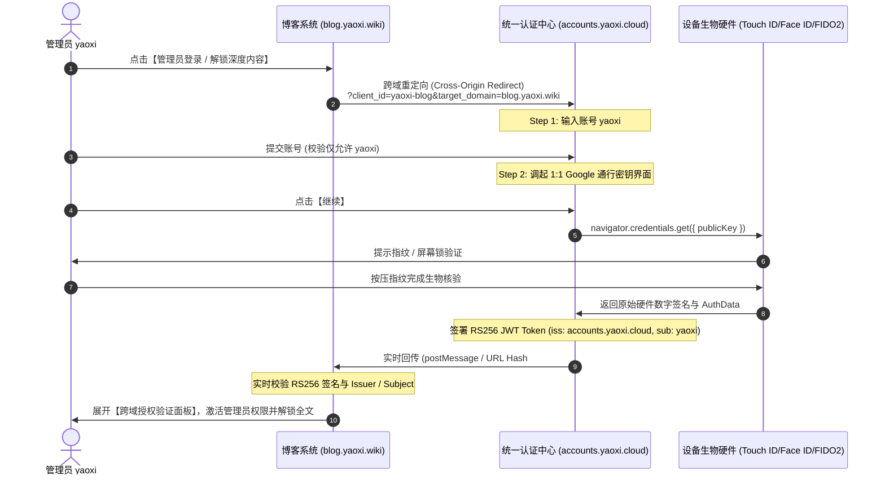

# accounts.yaoxi.cloud 统一身份认证中心 & blog.yaoxi.wiki 博客单点登录

基于 **FIDO2 / WebAuthn 通行密钥 (Passkey)** 与 **OAuth 2.0 / OIDC 协议** 打造的 1:1 Google Material 3 风格生产级身份认证中心。

---

## 🌟 生产架构规范

- **统一认证中心 (SSO Gateway)**: `https://accounts.yaoxi.cloud`
- **客户端博客系统 (Blog App)**: `https://blog.yaoxi.wiki`
- **授权管理员账号 (Whitelist)**: `yaoxi` (`yaoxi@yaoxi.cloud`)
- **认证模式**: 仅允许通行密钥硬件断言验证（`navigator.credentials.get()`，禁止自动创建），支持跨域实时 Token 签名回传。

---

## 📁 项目文件架构

```text
google-login-ui/
├── accounts-login.html    # 🏛️ accounts.yaoxi.cloud 1:1 Google 官方通行密钥认证中心
├── accounts-login.css     # Material 3 暗黑/浅色自适应规范与 1:1 矢量插画样式
├── accounts-login.js      # yaoxi 账号校验、WebAuthn 硬件断言与跨域 Token 签发
├── client-blog.html       # 🌐 blog.yaoxi.wiki 博客客户端系统 (跨域签名验证面板)
├── blog-login.html        # 🌟 全功能极客博客认证门户展示页
├── blog-login.css         # 博客门户样式
├── blog-login.js          # 博客前端交互逻辑
├── index.html             # 🎯 Google 登录仿真专属调试台
├── google-login.css       # Google 官方组件样式
├── google-login.js        # Google 登录仿真核心组件
├── png/                   # 1:1 官方参考截图目录
└── README.md              # 架构说明与集成文档
```

---

## 🔄 认证时序与跨域流程



---

## 🔑 生产签发 JWT 载荷示例 (Token Claims)

```json
{
  "iss": "https://accounts.yaoxi.cloud",
  "aud": "yaoxi-blog",
  "sub": "yaoxi",
  "name": "yaoxi",
  "email": "yaoxi@yaoxi.cloud",
  "email_verified": true,
  "roles": ["admin", "author", "super_user"],
  "scope": "openid profile email admin",
  "amr": ["passkey", "fido2", "hw_biometrics", "fingerprint"],
  "passkey_proof": {
    "authType": "webauthn_passkey_assertion",
    "signature": "verified"
  },
  "iat": 1787288400,
  "exp": 1787295600,
  "token_type": "Bearer"
}
```

---

## 🚀 本地实时测试与访问

```bash
# 启动本地服务
python3 -m http.server 8080 --directory /mnt/sdcard/google-login-ui
```

- 🏛️ **[accounts.yaoxi.cloud 认证中心](http://localhost:8080/accounts-login.html)**
- 🌐 **[blog.yaoxi.wiki 博客客户端系统](http://localhost:8080/client-blog.html)**
