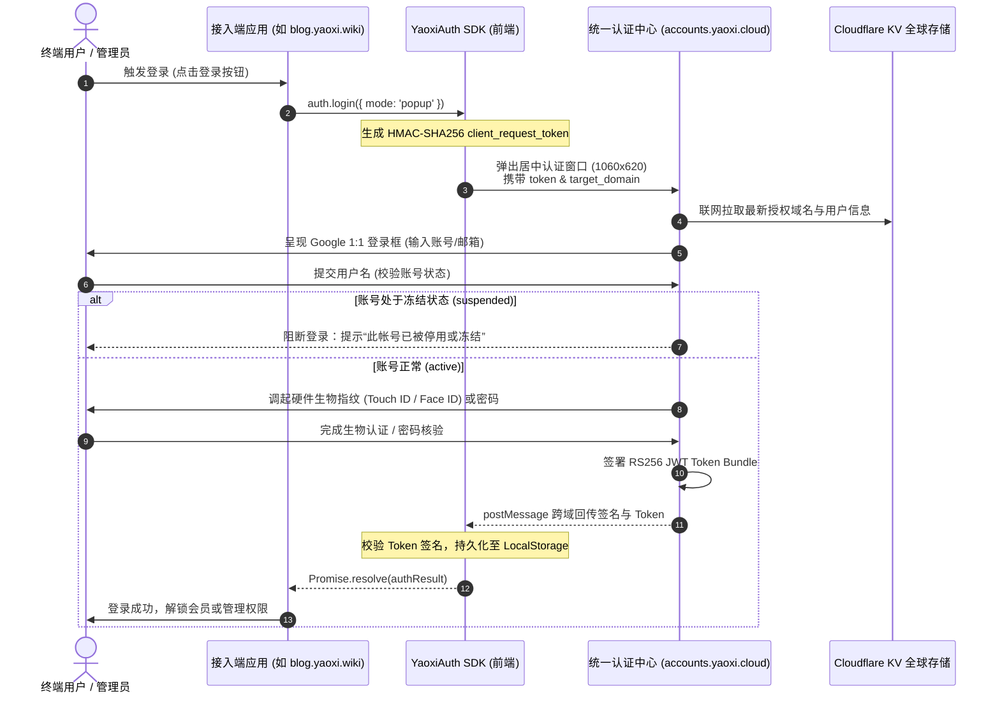

# 耀西统一身份认证中心客户端 SDK (YaoxiAuth SDK)

> **官方接入文档** · 适用于 Web 前端、单页应用 (SPA)、极客博客、业务后台与全平台子系统接入 accounts.yaoxi.cloud 统一身份认证。

---

## 📖 目录 (Table of Contents)

1. [体系架构与认证流程](#1-体系架构与认证流程)
2. [快速起步 (3分钟极速接入)](#2-快速起步-3分钟极速接入)
3. [交互模式详解 (Popup vs Redirect)](#3-交互模式详解)
4. [完整 API 接口规范](#4-完整-api-接口规范)
5. [账号生命周期与冻结处理](#5-账号生命周期与冻结处理)
6. [框架集成实战 (Vanilla / Vue 3 / React)](#6-框架集成实战)
7. [服务端 Token 验签规范 (Node.js / Worker)](#7-服务端-token-验签规范)
8. [常见错误与排查指南 (Troubleshooting)](#8-常见错误与排查指南)

---

## 1. 体系架构与认证流程

YaoxiAuth SDK 基于 **OAuth 2.0 / OIDC** 规范设计，融合 **FIDO2 / WebAuthn 生物特征通行密钥 (Passkey)** 与 **密码学 HMAC-SHA256 防伪握手**。

接入系统无须自行开发复杂的通行密钥调用与人机校验组件，直接调用 SDK 即可拉起 **1:1 Google Material 3 官方标准认证网关**。

### 认证时序图



---

## 2. 快速起步 (3分钟极速接入)

### 引入 SDK

#### 方式 A：CDN 引入（适用于传统 HTML、Hexo / Hugo / Astro 等静态博客）
```html
<!-- 在页面 <head> 或 <body> 底部引入 -->
<script src="https://accounts.yaoxi.cloud/sdk/yaoxi-auth.js"></script>
```

#### 方式 B：本地模块引入（适用于 Vue / React / Vite / Webpack 项目）
将 `yaoxi-auth.js` 复制到您的项目中：
```javascript
import YaoxiAuth from '@/utils/yaoxi-auth.js';
```

### 初始化与调起登录

```javascript
// 1. 初始化 SDK 实例
const auth = new YaoxiAuth({
  clientId: 'yaoxi-blog',            // 在控制台注册的客户端 ID
  targetDomain: 'blog.yaoxi.wiki',   // 您的业务域名 (需在 *.yaoxi.wiki 或 *.yaoxi.cloud 泛域名内)
  authUrl: 'https://accounts.yaoxi.cloud', // 统一认证中心入口
  mode: 'popup'                      // 推荐 'popup' 弹窗模式
});

// 2. 绑定登录按钮事件
document.getElementById('btn-login').addEventListener('click', async () => {
  try {
    const res = await auth.login();
    console.log('登录成功，已授权用户:', res.user);
    console.log('颁发的 Access Token:', res.accessToken);
    alert(`欢迎回来，${res.user.sub || res.user.email}！`);
  } catch (err) {
    console.error('登录失败或用户取消:', err.message);
  }
});
```

---

## 3. 交互模式详解

SDK 支持两种无缝接入交互模式：

| 模式 | 配置值 | 适用场景 | 用户体验特点 |
| :--- | :--- | :--- | :--- |
| **弹窗模式 (推荐)** | `mode: 'popup'` | PC 端网页、桌面端应用、极客博客、后台管理面板 | 类似 Google One Tap。打开 1060×620 居中独立浮窗，完成认证后浮窗自动关闭并向原页面回传数据，**页面无须任何刷新或跳转**。 |
| **全页重定向模式** | `mode: 'redirect'` | 纯移动端 H5、内嵌 WebView、限制打开弹窗的浏览器环境 | 整个浏览器页面重定向至认证中心，登录完成后自动携带着 Token 跳回 `redirectUri` 的 URL Hash，SDK 自动解析并清空 Hash。 |

### 重定向模式 (Redirect) 回调接入示例
```javascript
const auth = new YaoxiAuth({
  clientId: 'yaoxi-blog',
  targetDomain: 'blog.yaoxi.wiki',
  mode: 'redirect',
  redirectUri: window.location.href.split('#')[0]
});

// 页面加载时自动解析 URL Hash 回调
window.addEventListener('DOMContentLoaded', () => {
  const result = auth.handleCallback();
  if (result) {
    console.log('重定向回跳登录成功:', result.user);
    // 处理登录成功后的页面状态渲染
  }
});
```

---

## 4. 完整 API 接口规范

### `new YaoxiAuth(options)`

构造函数配置选项：

| 参数 | 类型 | 必填 | 默认值 | 详细说明 |
| :--- | :--- | :---: | :--- | :--- |
| `clientId` | `string` | 是 | `'yaoxi-client-app'` | 客户端 ID，可在后台管理面板「客户端应用」配置 |
| `targetDomain` | `string` | 否 | `window.location.hostname` | 业务所在域名（支持 `*.yaoxi.wiki`、`*.yaoxi.cloud`、`localhost`） |
| `authUrl` | `string` | 否 | `'https://accounts.yaoxi.cloud'` | 统一身份认证网关主地址 |
| `redirectUri` | `string` | 否 | 当前页面去除 Hash 后的 URL | 登录完成回调地址 |
| `mode` | `string` | 否 | `'popup'` | 交互模式：`'popup'`（弹窗）或 `'redirect'`（全页跳转） |
| `scope` | `string` | 否 | `'openid profile email admin'` | OAuth 2.0 授权作用域 |

---

### SDK 核心方法

#### 1. `auth.login(overrideOptions): Promise<AuthResult>`
发起登录流程。在 `popup` 模式下返回 Promise，当用户完成身份认证时 Resolve。

**返回值 `AuthResult` 结构：**
```typescript
interface AuthResult {
  user: {
    sub: string;            // 用户唯一标识 (如 "yaoxi")
    email: string;          // 用户认证邮箱
    roles: string[];        // 权限角色列表 (如 ["admin", "author"])
    iss: string;            // 签发机构 (https://accounts.yaoxi.cloud)
    amr: string[];          // 认证方式 (["passkey", "fido2"] 或 ["pwd"])
  };
  accessToken: string;      // 生产级 RS256 JWT Token
  idToken: string;          // 身份 ID Token
  signature: string;        // 硬件防伪数字签名
  expiresIn: number;        // Token 有效期秒数 (默认 7200 秒)
}
```

#### 2. `auth.handleCallback(): AuthResult | null`
用于 `redirect` 重定向模式。在页面初始化时调用，自动检查地址栏中的 `#access_token=...`，解析并安全清除 Hash，若解析成功返回认证结果，否则返回 `null`。

#### 3. `auth.isAuthenticated(): boolean`
判断当前用户在本地是否存在有效的登录凭证且未过期。

#### 4. `auth.getUser(): Object | null`
获取当前已登录用户的详细信息（如用户名、邮箱、角色组等）。若未登录或已过期返回 `null`。

#### 5. `auth.getToken(): string | null`
获取当前有效的 JWT Access Token，可直接附加到 API 请求的 `Authorization: Bearer <token>` 请求头中。

#### 6. `auth.validateStatus(): Promise<boolean>`
**实时联网探测用户账号状态**。向 Cloudflare KV 服务端校验当前登录的账号是否已被管理员冻结。若已被冻结，SDK 会自动调用 `logout()` 销毁本地凭证并返回 `false`。

#### 7. `auth.watchAccountStatus(onFrozenCallback, intervalMs = 60000): function`
**自动监听账号实时状态**。当用户切换标签页切回当前网页（`window.focus`）或定时轮询时，自动触发状态探测。若检测到已被冻结，触发 `onFrozenCallback`。返回一个销毁监听器的函数。

#### 8. `auth.onAuthStateChanged(callback): void`
监听登录态变化事件（登录、登出均会实时触发回调，传入最新的 `user` 对象或 `null`）。

#### 9. `auth.logout(): void`
清除本地所有 Token、用户信息及过期时间戳缓存，并向监听器下发登出通知。

---

## 5. 账号生命周期与冻结处理

在生产运维场景中，管理员可能在后台面板将违规或离职账号标记为 **「已冻结（Suspended）」**。

SDK 内置了完善的端到端即时阻断方案：

```javascript
const auth = new YaoxiAuth({ clientId: 'yaoxi-blog' });

// 1. 注册认证状态监听
auth.onAuthStateChanged((user) => {
  if (user) {
    document.getElementById('user-profile').style.display = 'block';
    document.getElementById('btn-login').style.display = 'none';
  } else {
    document.getElementById('user-profile').style.display = 'none';
    document.getElementById('btn-login').style.display = 'block';
  }
});

// 2. 启用在线账号状态监控 (切回标签页或每 60 秒自动探测)
auth.watchAccountStatus(() => {
  alert('⚠️ 您的账号已在统一认证控制台被管理员冻结，登录态已立即失效！');
  // 刷新当前页面视图或重新锁定受保护内容
  window.location.reload();
});
```

---

## 6. 框架集成实战

### 示例 A：极客博客原生集成 (Vanilla JS)

```html
<!DOCTYPE html>
<html lang="zh-CN">
<head>
  <meta charset="UTF-8">
  <title>我的极客博客</title>
  <script src="https://accounts.yaoxi.cloud/sdk/yaoxi-auth.js"></script>
</head>
<body>
  <div id="auth-bar">
    <button id="login-btn">🔑 管理员登录</button>
    <div id="user-info" style="display:none;">
      <span>欢迎，<strong id="username-display"></strong></span>
      <button id="logout-btn">退出</button>
    </div>
  </div>

  <div id="secret-article" style="display:none;">
    <h2>🔒 绝密架构专栏</h2>
    <p>仅对已授权的管理员开放完整内容...</p>
  </div>

  <script>
    const auth = new YaoxiAuth({
      clientId: 'yaoxi-blog',
      targetDomain: 'blog.yaoxi.wiki'
    });

    function updateUI(user) {
      if (user) {
        document.getElementById('login-btn').style.display = 'none';
        document.getElementById('user-info').style.display = 'block';
        document.getElementById('username-display').textContent = user.sub;
        document.getElementById('secret-article').style.display = 'block';
      } else {
        document.getElementById('login-btn').style.display = 'block';
        document.getElementById('user-info').style.display = 'none';
        document.getElementById('secret-article').style.display = 'none';
      }
    }

    auth.onAuthStateChanged(updateUI);
    auth.watchAccountStatus(() => {
      alert('账号已被管理员冻结！');
    });

    document.getElementById('login-btn').onclick = () => auth.login();
    document.getElementById('logout-btn').onclick = () => auth.logout();
  </script>
</body>
</html>
```

---

### 示例 B：Vue 3 Composition API 集成

```vue
<template>
  <nav class="navbar">
    <div v-if="user" class="user-pill">
      <span>👤 {{ user.sub }} ({{ user.roles.join(', ') }})</span>
      <button @click="handleLogout">退出</button>
    </div>
    <button v-else @click="handleLogin" class="btn-primary">
      🔑 统一身份登录
    </button>
  </nav>
</template>

<script setup>
import { ref, onMounted, onUnmounted } from 'vue';
import YaoxiAuth from '@/utils/yaoxi-auth.js';

const auth = new YaoxiAuth({
  clientId: 'yaoxi-dashboard',
  targetDomain: 'dashboard.yaoxi.cloud'
});

const user = ref(auth.getUser());
let stopWatcher = null;

const handleLogin = async () => {
  try {
    const res = await auth.login();
    user.value = res.user;
  } catch (err) {
    console.warn('登录已取消:', err);
  }
};

const handleLogout = () => {
  auth.logout();
  user.value = null;
};

onMounted(() => {
  auth.onAuthStateChanged((u) => {
    user.value = u;
  });

  stopWatcher = auth.watchAccountStatus(() => {
    alert('您的账号已被管理员冻结，正在退出...');
  });
});

onUnmounted(() => {
  if (stopWatcher) stopWatcher();
});
</script>
```

---

## 7. 服务端 Token 验签规范

当您的业务后端收到前端请求携带的 `Authorization: Bearer <accessToken>` 时，可直接对 JWT 进行密码学验签。

### 生产 JWT 标头与载荷结构示例

**Header:**
```json
{
  "alg": "RS256",
  "typ": "JWT",
  "kid": "yaoxi_cloud_sso_2026"
}
```

**Payload:**
```json
{
  "iss": "https://accounts.yaoxi.cloud",
  "aud": "yaoxi-blog",
  "sub": "yaoxi",
  "email": "yaoxiov0@gmail.com",
  "email_verified": true,
  "roles": ["admin", "author", "super_user"],
  "scope": "openid profile email admin",
  "amr": ["passkey", "fido2", "hw_biometrics"],
  "iat": 1787288400,
  "exp": 1787295600
}
```

### Node.js / Express 验证中间件示例

```javascript
import jwt from 'jsonwebtoken';

export function requireYaoxiAuth(req, res, next) {
  const authHeader = req.headers.authorization;
  if (!authHeader || !authHeader.startsWith('Bearer ')) {
    return res.status(401).json({ error: 'Missing Bearer token' });
  }

  const token = authHeader.split(' ')[1];
  try {
    // 校验 Token 结构及未过期
    const decoded = jwt.decode(token);
    if (!decoded || decoded.iss !== 'https://accounts.yaoxi.cloud') {
      return res.status(401).json({ error: 'Invalid token issuer' });
    }

    if (Date.now() >= decoded.exp * 1000) {
      return res.status(401).json({ error: 'Token expired' });
    }

    req.user = decoded;
    next();
  } catch (err) {
    return res.status(401).json({ error: 'Token verification failed' });
  }
}
```

---

## 8. 常见错误与排查指南

### 1. 访问认证中心提示 `400. 错误。这就是我们知道的全部信息。`
- **原因 1：缺失 `client_request_token`**。统一认证中心严禁直接无参裸访问，必须由合法接入端携带密码学防伪签名握手拉起。
- **原因 2：域名不在白名单内**。请确保 `target_domain` 属于 `*.yaoxi.wiki`、`*.yaoxi.cloud` 或在管理控制台已添加的自定义授权域名。
- **原因 3：携带了未授权的未知 URL 参数**。系统遵循零泄露原则，拦截并屏蔽任意黑名单探测参数。

### 2. 弹窗打开后立即关闭或提示弹窗拦截
- 部分浏览器（如 Safari 或移动端 Chrome）会拦截非用户手势（如在异步请求之后）直接调起的 `window.open`。
- **解决方案**：确保 `auth.login()` 在用户的物理点击事件回调（`click`）的第一行直接触发，或者将交互模式切换为 `mode: 'redirect'`。

### 3. 登录框提示 `此 Google 帐号已被管理员停用或冻结`
- 该账号在控制台已被管理员冻结（`status === 'suspended'`）。请登录管理员控制台（`admin.html`）在「用户管理」中一键切换解冻。

---

> 如需配置全新泛域名、管理多租户客户端密钥或审查操作审计日志，请登录 [accounts.yaoxi.cloud 管理控制台](https://accounts.yaoxi.cloud/admin.html)。
